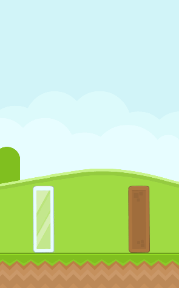

# Assignment 5 - Angry Birds 🐦

- 💯**Worth**: 7%
- 📅**Due**: November 6, 2022 @ 23:59
- 🙅🏽‍**Penalty**: Late submissions lose 10% per day to a maximum of 3 days. Nothing is accepted after 3 days and a grade of 0% will be given.

## 🎯 Objectives

- Read and understand all of the Angry Birds [notes](https://jac-cs-game-programming-fall22.github.io/Notes/#/5-Angry-Birds/) and [source code](https://github.com/JAC-CS-Game-Programming-Fall22/5-Angry-Birds) from Lecture 5.
- Implement 2 of the following: the Blue Bird, Yellow Bird, White Bird, or Black Bird.
- Implement additional game elements to make the game more interesting to play.

## 🔍 Context

Welcome to your sixth assignment! This week, we took a look at the fundamentals of [Matter.js](https://brm.io/matter-js), a fantastic 2D JavaScript physics engine, and how it ties into HTML5 canvas by implementing our own version of Angry Birds. This assignment will have you adding some more features to make our Angry Birds more fun and interesting to play!

### 🐦 More Birds

**Choose TWO** of the following _birds_ to implement. One bird must be either Blue or Yellow, and the other must be either White or Black. In other words, you can't (only) do both Blue and Yellow unless, of course, you want to implement more than 2 birds!

I've also included the sprite measurements since this particular spritesheet is a nightmare... You're welcome 😉

#### 💙 Blue Bird

When the Blue Bird is in flight and the player hits the spacebar, the bird should spawn 2 more copies of itself to rain down terror on the pig fortress.


> 💡 Hint: The additional birds can be more instances of `BlueBird`. To get them to go in slightly different directions, use [Body.applyForce()](https://brm.io/matter-js/docs/classes/Body.html#method_applyForce). See `Bird::jump()` for an example of how to use this function.

```javascript
static SPRITE_MEASUREMENTS = [{ x: 1, y: 379, width: 32, height: 30 }];
```

#### 💛 Yellow Bird

When the Yellow Bird is in flight and the player hits the spacebar, the bird should gain a burst of speed and accelerate more sharply towards the pig fortress.


> 💡 Hint: Use [Body.applyForce()](https://brm.io/matter-js/docs/classes/Body.html#method_applyForce) for the burst of speed. See `Bird::jump()` for an example of how to use this function.

```javascript
static SPRITE_MEASUREMENTS = [{ x: 668, y: 879, width: 58, height: 54 }];
```

#### 🤍 White Bird

When the White Bird is in flight and the player hits the spacebar, the bird should lay an egg that can act as a projectile to damage pigs and blocks. The act of laying the egg should propel the bird upwards. The bird itself should become a shrivelled version of itself (i.e. smaller sprite and radius) after the egg has been laid. The shrivelled version of the bird can still damage pigs/blocks. The bird should also play an egg-laying animation. It's hard to see because it's fast in the gif, but it's there if you look closely:


> 💡 Hint: The egg will be an entity just like everything else. Use [Body.applyForce()](https://brm.io/matter-js/docs/classes/Body.html#method_applyForce) for propelling the bird upwards. See `Bird::jump()` for an example of how to use this function.
>
> To lay the egg after the animation, remember that `Animation::isDone()` is a thing!

```javascript
static SPRITE_MEASUREMENTS = [
    { x: 410, y: 542, width: 80, height: 93 },
    { x: 410, y: 353, width: 80, height: 93 },
    { x: 410, y: 448, width: 80, height: 93 },
    { x: 493, y: 353, width: 85, height: 93 },
    { x: 667, y: 752, width: 50, height: 65 },
    { x: 668, y: 820, width: 45, height: 57 },
];
```

#### 🖤 Black Bird

When the Black Bird lands on the ground an comes to a complete stop, the bird should explode causing a shockwave to push/damage the blocks and pigs. The bird should also play a charging-up animation before it explodes:


> 💡 Hint: Create lots of small Matter bodies (i.e. shrapnel) and send them every which way around the bird (again, using [Body.applyForce()](https://brm.io/matter-js/docs/classes/Body.html#method_applyForce)) to make it look like there's a shockwave. These small, dense bodies will then interact with any surrounding bodies and push them away and damage them.
> 
> To explode after the animation, remember that `Animation::isDone()` is a thing!

```javascript
static SPRITE_MEASUREMENTS = [
    { x: 410, y: 725, width: 62, height: 82 },
    { x: 778, y: 446, width: 62, height: 82 },
    { x: 715, y: 446, width: 62, height: 82 },
    { x: 588, y: 446, width: 62, height: 82 },
    { x: 651, y: 446, width: 62, height: 82 },
    { x: 673, y: 353, width: 90, height: 90 },
];
```

### ⚡ Additional Features

**Choose TWO** of the following _features_ to implement:

#### 💥 Explosions

You can see from the gifs above that the blocks are playing a little explosion animation when they are destroyed.

```javascript
static SPRITE_MEASUREMENTS = [
    { x: 169, y: 513, width: 115, height: 111 },
    { x: 169, y: 400, width: 113, height: 110 },
    { x: 169, y: 277, width: 126, height: 122 },
    { x: 169, y: 155, width: 126, height: 122 },
];
```

> 💡 Hint: Use the `Animation` library!

#### 🪞 Glass Blocks

Glass blocks should break much easier than wood blocks. In the example below, the bird is being dropped from a much lower height over the glass block to get it to break versus the wood block:



> 💡 Hint: Play with the `density` property!

#### 🥊 Resilient Enemies

Pigs should be able to take multiple hits before dying. The visual indication of this is using the black-eye sprites:


```javascript
static SPRITE_MEASUREMENTS = [
    { x: 987, y: 744, width: 48, height: 46 },
    { x: 733, y: 904, width: 48, height: 46 },
    { x: 733, y: 856, width: 48, height: 46 },
];
```

> 💡 Hint: Implement some sort of `health` property on `Pig` that gets decremented when the pig gets hit by a bird or block in `Fortress`. Then, render the appropriate sprite.

#### ⭐ Stars

Award the player a maximum of 3 stars on the Victory screen based on how many moves it took to clear the pigs from the level. As a simple example, if you give the player 3 birds to complete a level and they manage to defeat all the pigs using just one bird, then the player would get 3 stars. If they had to use all 3 birds to win, then they would only get 1 star. It's up to you to fine tune the values you think are appropriate to award the player a fair number of stars based on the level parameters.


There are 2 sprites you should use to implement this. The star itself and the star placeholder. The placeholder should always appear, and the actual star sprites should be "filled in" based on how many stars the player was awarded. You'll find both sprites in the `assets/` folder as usual.

## 🌿 Git

You can use either the Git CLI or you can also use VSC's built-in Git GUI client.

### 🖱️ GUI

1. In VSC, click on the third icon down in the left navigation bar to see a list of files that have changed and are ready to be staged.
2. Hover over where it says _Changes_ (right below the commit textbox) and click `+` to stage all the modified files to be committed. Alternatively, you can add specific files by clicking the `+` next to the individual file.
3. Type a commit message into the textbox and click the checkmark above it to commit all the files that were just staged.
4. Click `...` and then `push` to push the commit(s) up to GitHub.

### ⌨️ CLI

1. Run `git status` to see a list of files that have changed and are ready to be staged.
2. Run `git add .` to stage all the modified files to be committed. Alternatively, you can add specific files like this: `git add src/Bird.js`.
3. Run `git commit -m "A descriptive message here."` (including the quotes) to commit all the files that were just staged.
4. Run `git push` to push the commit(s) up to GitHub.

Regardless of the method you choose, it is very important that you commit frequently because:

- If you end up breaking your code, it is easy to revert back to a previous commit and start over.
- It provides a useful log of your work so that you (and your teammates if/when you're on a team) can keep track of the work that was done.

## 📥 Submission

> 💡 Note that the grading criteria can be found on Gradescope, but only after you've submitted. You're able to submit infinitely, so it might be a good idea to submit a blank repo first in order to reference the grading criteria while working on this assignment.

Once you've made your final `git push` to GitHub, here's what you have to do to submit:

1. Go to [Gradescope](https://www.gradescope.ca/courses/7664) and click the link for this assignment.
2. Select the correct repository and branch from the dropdown menus.
3. Click _Upload_.
4. Record a screencast, **not to exceed 5 minutes in length**, in which you demonstrate your game's functionality.
   - The video should be recorded and uploaded using Microsoft Stream. [Please watch this instructional video on how to do so](https://web.microsoftstream.com/video/62738103-211f-4ddd-bb4a-c594eddcfb0a?list=studio) (you'll have to log in with your JAC email and password).
     - In the instructional video I mention to toggle on the "share sound" option. I later realized that it might be hard to hear what you'll be saying if the game music is playing, so feel free to toggle off the "share sound" option if you find that it's hard to hear yourself over the music in the recording.
   - In your video's description, please timestamp where each of the following occurs in your gameplay demonstration:
     - Each bird you chose to implement (2 timestamps, one per bird)
     - Each additional feature you chose to implement (2 timestamps, one per feature)
